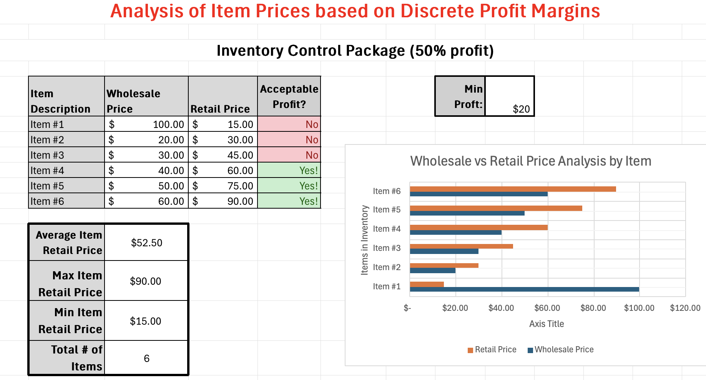
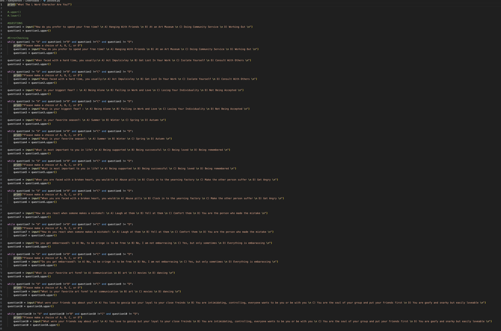
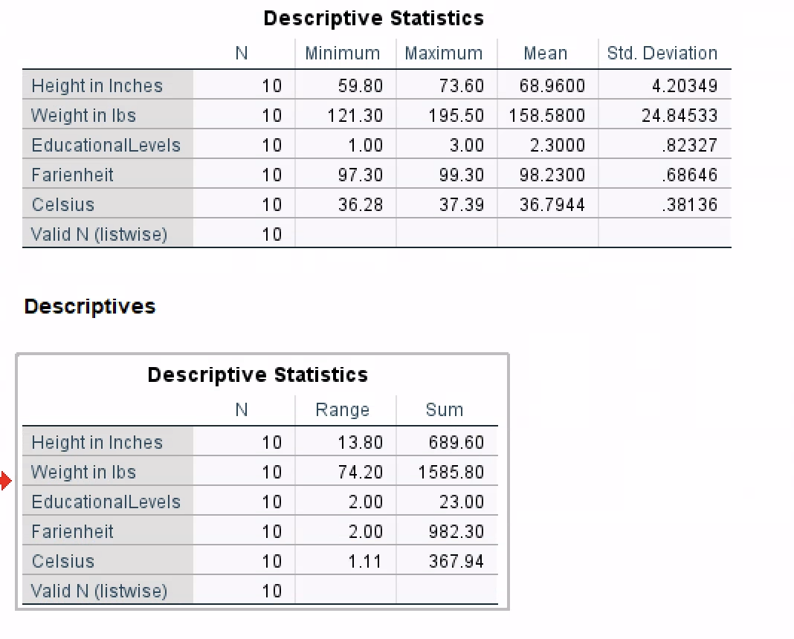

 
# Entertainment Publicst

### About Me
Hello! I am a current student studying Communications and Media with two years of proven expertise in Public Relations and Social Media Management. 

With skills in Strategic Thinking, Positivity, Creativity, and Relationship Building, I can collaborate with others on case studies and achieve a deeper understanding of Public Relations. 

I am adept at using Excel, JDoodle, and SPSS. My personalized skill set, commitment to social justice, and passion for pop culture make me a valuable asset.  

In my spare time, I like to play softball and discover new films. You can find me on [LinkedIn](https://www.linkedin.com/in/katharine-pierlott​​).
 

### Education 
BArts in Communication and Media
Loyola University, MD

### Projects

#### Excel Formulas and Functions
 

_Initial project idea: 
How did you come up with this project? What problem did you set out to solve, and why was it a problem that needed to be solved?_

The problem I have set out to solve is how to evaluate data through formulas and using built in calculations. This problem needed to be solved because it allowed for me to have a visual understanding of my faux company. In addition, it allowed me to work on strengthening my Excel skills.
                                                      
_Tools I used: 
What tools did you use in completing this project?_

The tools I used to complete this project were Excel and strategic thinking. In addition, I used my resources such as the internet, fellow students, and my professor. 

_Challenges I faced:
What challenges did you face, and how? What obstacles did you overcome?_

As someone being new to excel, I faced challenges surrounding how to apply formulas such as conditional formatting. However, through asking questions and trial and error, I was able to overcome this challenge. 

_Other Resources: 
Did you used any other resources? Did you collaborate with anyone to get this done?_

As I have previously mentioned, I also relied on my fellow classmates to guide me through the challenges I faced.

_Result:
What did you set out to achieve? Did you achieve it? What improvements would you like to make if you had a chance to take this further?_

Overall, I achieved my goal of creating a data set that would evaluate how my faux company was doing. I received a 10/10 for this assignment. If I had the chance to take this assignment further, I would evaluate my competitor data well. 

***
#### JDoodle Personality Test
 

_Initial project idea: 
How did you come up with this project? What problem did you set out to solve, and why was it a problem that needed to be solved?_

The problem I have set out to solve is how to create a personality test via JDoddle. This personality test would consist of questions that would place users into different personality types. This personality test would tell users what The L Word character they are. The choices were between Alice Pieszecki, Bette Porter, Tina Kennard, and Dana Fairbanks. By solving this problem, I strengthened my coding skills. 
                
_Tools I used: 
What tools did you use in completing this project?_

The tools I used to complete this project were JDoodle and strategic thinking. In addition, I used my resources such as the internet, fellow students, and my professor. I also used the virtue of patience, as I struggled with some concepts.

_Challenges I faced:
What challenges did you face, and how? What obstacles did you overcome?_ 

As someone new to coding and JDoodle, some concepts stumped me. For instance, looping and error checking, were two concepts that I struggled with understanding. However, through patience and hard work as well as using my resources, I was able to overcome these challenges. I learned to break down coding and focus on individual parts first. 

_Other Resources: 
Did you used any other resources? Did you collaborate with anyone to get this done?_ 

As I have previously mentioned, I also relied on my fellow classmates to guide me through the challenges I faced. While I did the work myself, I did collaborate with others if I had questions.

_Result:
What did you set out to achieve? Did you achieve it? What improvements would you like to make if you had a chance to take this further?_ 

Overall, I achieved my goal of creating a functioning personality set that would use responses from the user to categorize them. If I had the chance to take this further, I would add more characters to make the personality test more in depth.

***
#### Pearson Correlation
 

_Initial project idea: 
How did you come up with this project? What problem did you set out to solve, and why was it a problem that needed to be solved?_

The problem I have set out to solve is how to find a measure of correlation between independent and dependent variables using SPSS. By solving this problem, I strengthened my SPSS skills and also learned how to find the correlation. 

_Tools I used: 
What tools did you use in completing this project?_

The tools I used to complete this project were SPSS and strategic thinking. In addition, I used my resources such as the internet, fellow students, lecture videos and my professor. 

_Challenges I faced:
What challenges did you face, and how? What obstacles did you overcome?_

A challenge I faced when participating in this project was how to access the data set and place it into SPSS. I was (and still am) confident in creating the graphs and finding the correlation, however I struggled with accessing the data set. Since I was using SPSS, I needed to access the data set within the Apporto system. Once I figured that out and overcame that challenge, I was able to complete this project. 

_Other Resources: 
Did you used any other resources? Did you collaborate with anyone to get this done?_

As I have previously mentioned, I also relied on my fellow classmates to guide me through the challenges I faced.

_Result:
What did you set out to achieve? Did you achieve it? What improvements would you like to make if you had a chance to take this further?_

Overall, I achieved my goal of finding the correlation between an independent and dependent variable. If I had the chance to take this project further, I would use the data I collected from Module 6. 

